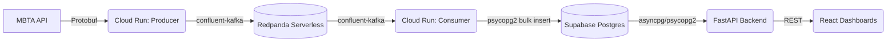

# MBTA Telemetry Pipeline


A robust, real-time data engineering pipeline designed to ingest, process, and persist high-velocity transit telemetry data.

## Executive Summary (For Non-Technical Readers & Recruiters)
This project solves a classic Big Data problem: how do you reliably capture thousands of real-time GPS coordinates every minute without spending a fortune on cloud servers? 

The **MBTA Telemetry Pipeline** continuously pulls live location data from the Boston public transit system (MBTA). Instead of processing it all at once on a massive server, the pipeline breaks the work down using a "Serverless" architecture. It acts like a highly efficient post office—one tiny robot fetches the data and drops it in a secure queue (Redpanda), and another tiny robot wakes up a minute later to deliver it to the database (Supabase). Because these robots only live for a few seconds, the entire infrastructure costs **$0 a month** to run, while still handling enterprise-grade data volumes.

## Technical Overview (For Software Engineers)
The pipeline utilizes an event-driven, decoupled microservices architecture to ingest GTFS-Realtime (Protocol Buffers) vehicle position data. By isolating the extraction and loading phases via a message broker, the system achieves maximum fault tolerance.



### Technology Stack
*   **Languages:** Python 3.10+, JavaScript (React)
*   **Compute:** Google Cloud Run (Serverless) + Google Cloud Scheduler
*   **Message Broker:** Redpanda Cloud Serverless (Kafka-compatible)
*   **Database:** Supabase Serverless PostgreSQL
*   **API Layer:** FastAPI
*   **Frontend UI:** React + Vite (Map & Metrics Dashboards)
*   **Data Serialization:** Protocol Buffers (Protobuf)
*   **Containerization:** Docker & Docker Compose

---

## Recent Development: Dashboards & API

We have expanded the pipeline beyond an ingestion engine by building out the presentation layer:

1. **FastAPI Backend (`services/api`)**: A lightweight containerized Python API that securely queries Supabase and calculates real-time ingestion metrics, latency, and active vehicle counts.
2. **Metrics Dashboard (`services/metrics_dashboard`)**: A sleek, dark-mode terminal-inspired (xAI aesthetic) React application. It polls the FastAPI backend to visualize the overall health, latency, and ingestion rate of the data pipeline.
3. **Data Particle Flow Visualizer (`services/flow_dashboard`)**: A cinematic, Matrix-inspired HTML5 `<canvas>` application. It translates the real-time backend ingestion rate into an abstract particle animation, physically demonstrating the data flow from the MBTA API, through Kafka, and into the Database.
4. **Local Orchestration (`docker-compose.yml`)**: We introduced Docker Compose to easily spin up the API and Kafka Consumer locally without fighting OS-level Python dependencies, perfectly mirroring the isolated Cloud Run architecture.

---

## Architectural Trade-offs & Design Decisions

### 1. Serverless Cloud Run vs. "Always-On" Containers
*   **Trade-off:** I chose ephemeral Cloud Run Jobs triggered via Cloud Scheduler instead of an always-running Kubernetes cluster.
*   **Why:** Batching the ingestion and consumption into cron-triggered serverless jobs reduced our cloud bill from ~$50/month to **$0/month**.

### 2. `confluent-kafka` (C-Backed) vs. `kafka-python` (Pure Python)
*   **Trade-off:** I opted for `confluent-kafka` which requires compiling C-extensions (`librdkafka`).
*   **Why:** Pure Python Kafka libraries struggle with SNI routing in modern Serverless environments like Redpanda. The C-library drastically improved network stability and serialization speed. 

### 3. Redpanda vs. Apache Kafka
*   **Trade-off:** I chose Redpanda over standard Apache Kafka or AWS MSK.
*   **Why:** Redpanda is a C++ Kafka-compatible broker that eliminates JVM and Kraft overhead, providing the exact Kafka API needed without traditional minimum node-count requirements.

### 4. Bulk PostgreSQL Inserts vs. Streaming Upserts
*   **Trade-off:** The consumer drains the Kafka queue into local memory and performs a single `execute_values()` bulk insert.
*   **Why:** By aggressively batching the data, we minimize I/O overhead and protect the database from connection starvation during horizontal scale-outs.

---

## Getting Started (Local Development)

To run the pipeline and dashboards locally:

1. **Clone the repository:** `git clone https://github.com/DantheCE/mbta-telemetry-pipeline.git`
2. **Set up Environment:** Create a single `.env` file at the root of the project with your Kafka and Supabase credentials.
3. **Spin up the Backend:** 
   ```bash
   docker compose up -d
   ```
   This will build and start the `api` (port 8080) and the `consumer` daemon in isolated Linux containers.
4. **Run the Producer:** Trigger the telemetry ingestion job manually.
   ```bash
   python services/telemetry_producer/producer.py
   ```
5. **Start the Dashboards:**
   Navigate into either dashboard directory and start the Vite dev server:
   ```bash
   cd services/metrics_dashboard
   npm install && npm run dev
   ```
