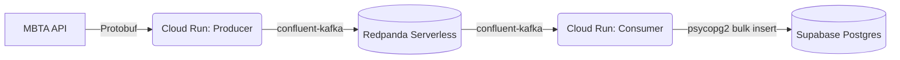

# MBTA Telemetry Pipeline

A robust, real-time data engineering pipeline designed to ingest, process, and persist high-velocity transit telemetry data. 

## Executive Summary (For Non-Technical Readers & Recruiters)
This project solves a classic Big Data problem: how do you reliably capture thousands of real-time GPS coordinates every minute without spending a fortune on cloud servers? 

The **MBTA Telemetry Pipeline** continuously pulls live location data from the Boston public transit system (MBTA). Instead of processing it all at once on a massive server, the pipeline breaks the work down using a "Serverless" architecture. It acts like a highly efficient post office—one tiny robot fetches the data and drops it in a secure queue (Redpanda), and another tiny robot wakes up a minute later to deliver it to the database (Supabase). Because these robots only live for a few seconds, the entire infrastructure costs **$0 a month** to run, while still handling enterprise-grade data volumes.

## Technical Overview (For Software Engineers)
The pipeline utilizes an event-driven, decoupled microservices architecture to ingest GTFS-Realtime (Protocol Buffers) vehicle position data. By isolating the extraction and loading phases via a message broker, the system achieves maximum fault tolerance. If the database goes down, the ingestion service continues to happily queue data into Kafka.

### Technology Stack
*   **Languages:** Python 3.10+
*   **Compute:** Google Cloud Run Jobs (Serverless) + Google Cloud Scheduler
*   **Message Broker:** Redpanda Cloud Serverless (Kafka-compatible)
*   **Database:** Supabase Serverless PostgreSQL + Supavisor (Transaction Pooler)
*   **Orchestration:** GitHub Actions (for nightly ETLs)
*   **Data Serialization:** Protocol Buffers (Protobuf)
*   **Containerization:** Docker (Multi-stage builds)

---

## Architectural Trade-offs & Design Decisions

Building scalable data pipelines requires balancing latency, complexity, and cost. Here are the major trade-offs made during development:

### 1. Serverless Cloud Run vs. "Always-On" Containers
*   **Trade-off:** I chose ephemeral Cloud Run Jobs triggered via Cloud Scheduler instead of an always-running Kubernetes cluster or ECS service.
*   **Why:** While an always-on container provides sub-millisecond latency for processing events, it incurs 24/7 compute costs. Transit data is highly valuable but a 1-minute processing delay is acceptable. Batching the ingestion and consumption into cron-triggered serverless jobs reduced our cloud bill from ~$50/month to literally **$0/month**.

### 2. `confluent-kafka` (C-Backed) vs. `kafka-python` (Pure Python)
*   **Trade-off:** I opted for `confluent-kafka` which requires compiling C-extensions (`librdkafka`) instead of the much easier-to-install `kafka-python` pure Python library.
*   **Why:** Pure Python Kafka libraries historically struggle with Server Name Indication (SNI) routing in modern, multi-tenant cloud environments like Redpanda Serverless, leading to silent connection drops and 60-second timeouts. Using the industry-standard C-library drastically improved network stability and serialization speed. 

### 3. Redpanda vs. Apache Kafka
*   **Trade-off:** I chose Redpanda over standard Apache Kafka or AWS MSK.
*   **Why:** Redpanda is a C++ Kafka-compatible broker that eliminates the need for JVMs and Zookeeper/Kraft. The Serverless Cloud tier provided the exact Kafka API we needed without the massive operational overhead or minimum node-count requirements of traditional Kafka clusters.

### 4. Bulk PostgreSQL Inserts vs. Streaming Upserts
*   **Trade-off:** The consumer drains the Kafka queue into local memory and performs a single `execute_values()` bulk insert into Postgres, rather than inserting rows one-by-one as they arrive.
*   **Why:** Cloud Run instances scaling horizontally can quickly exhaust a database's TCP connection limit. By aggressively batching the data and leveraging Supabase's Transaction Pooler (port `6543`), we minimize I/O overhead and protect the database from connection starvation. Kafka offsets are strictly committed *only* after a successful Postgres transaction to guarantee zero data loss.

---

## Future Roadmap: Frontend Dashboard

Currently, the pipeline acts as a highly optimized backend engine. **The immediate next step in the roadmap is to build a modern, responsive frontend web application.** 

The web app will query the Supabase PostgreSQL database to visualize the MBTA data in a meaningful way, allowing users to track real-time transit telemetry, visualize vehicle delays, and explore historical route aggregations through interactive mapping components.

## Getting Started

*(Note: Production infrastructure relies on Google Cloud Platform and GitHub Actions. To run locally, ensure you have Docker installed and valid `.env` credentials.)*

1. **Clone the repository:** `git clone https://github.com/DantheCE/mbta-telemetry-pipeline.git`
2. **Set up Environment Variables:** Create `.env` files in both `services/telemetry_producer` and `services/telemetry_consumer`.
3. **Build the Containers:** Use `docker build` targeting the respective directories.
4. **Trigger the Jobs:** Locally execute the containers, or deploy them to GCP and trigger via `gcloud run jobs execute`.
